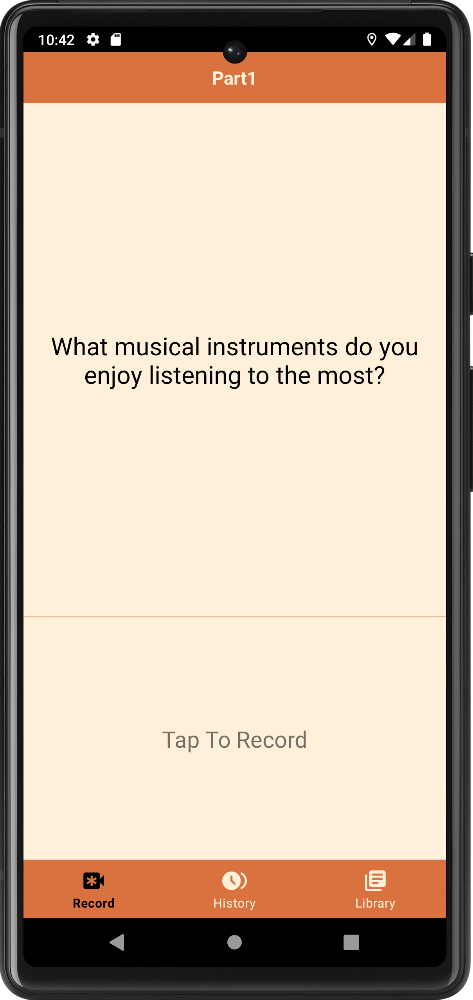
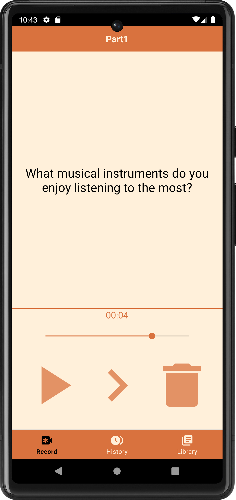

# Wattson

## Description
Wattson is a multi-functional IELTS speaking practice assistant designed to help candidates achieve better results in their IELTS speaking tests. As speaking practice is crucial for the IELTS oral exam, where every opportunity to speak can enhance one's proficiency, this software specifically targets the Chinese Mainland IELTS speaking question bank for September to December 2023. It allows users to train anywhere and anytime in the most relaxed and efficient manner, aiming to improve their performance in IELTS speaking.

<div align="center">
    
</div>

## Features
1. **Question Display**: Immediately presents questions from the IELTS speaking question bank upon opening the app.
2. **Record & Play**: Offers one-tap functionality to start recording sessions and playback for review.
3. **Question Library & Recording History**: Enables a comprehensive overview of the question bank and access to playback recordings.
<div align="center">
    
    
</div>

## Future Work
- [ ] **Note-Taking Feature**: Implement a feature to add custom notes to each recording, enhancing personalized study and learning.
- [ ] **Speech-to-Text Conversion**: Integrate functionality to transcribe spoken words, facilitating easier modification and review of responses.
- [ ] **OpenAI API Integration**: Incorporate feedback and advanced editing capabilities using OpenAI's API for improved self-assessment.

## Directory
```
.
├── APK
│   └── wattson.apk
├── app
│   └── src
│       └── main
│           ├── AndroidManifest.xml
│           ├── assets
│           │   └── questions.csv
│           ├── java
│           │   └── com
│           │       └── example
│           │           └── wattson
│           │               ├── AudioManager.java
│           │               ├── AudioRecording.java
│           │               ├── CustomExpandableListAdapter.java
│           │               ├── DatabaseHelper.java
│           │               ├── DetailActivity.java
│           │               ├── HistoryFragment.java
│           │               ├── LibraryFragment.java
│           │               ├── MainActivity.java
│           │               ├── RecordFragment.java
│           │               ├── RecordingPlaybackActivity.java
│           │               └── UIHelpers.java
│           ├── res
│           │   ├── color
│           │   │   └── nav_text_colors.xml
│           │   ├── drawable
│           │   │   └── wattson_round_background.xml
│           │   ├── layout
│           │   │   ├── activity_detail.xml
│           │   │   ├── activity_main.xml
│           │   │   ├── activity_playback.xml
│           │   │   ├── fragment_account.xml
│           │   │   ├── fragment_history.xml
│           │   │   ├── fragment_library.xml
│           │   │   ├── fragment_record.xml
│           │   │   ├── list_group.xml
│           │   │   └── list_item.xml
│           │   ├── menu
│           │   │   └── bottom_navigation_menu.xml
│           │   └── values
│           │       ├── colors.xml
│           │       ├── refs.xml
│           │       ├── strings.xml
│           │       └── themes.xml
│           └── wattson_round-playstore.png
├── README.md
└── report
   └── report.pdf
```

## License
Wattson is licensed under [MIT License](LICENSE).
